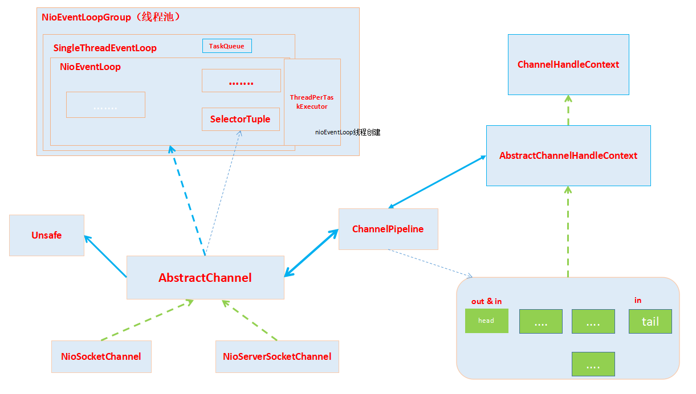

### I/O 多路复用 ###

```textmate
Select最大缺点FD限制， 默认1024
Epoll所支持的FD上限是操作系统的最大文件句柄数, 通常和系统内存关系比较大, 查看 cat /proc/sys/fs/file-max

传统select/poll会线性扫描全部的集合，导致效率线性下降， epoll只针对“活跃”的socket进行操作，这是因为epoll在
内核根据每个fd的函数实现, 只有活跃的socket才会主动调用callback函数


epoll是通过内核和用户空间mmap同一块内存来实现, 即我们平常理解的堆外内存

```

> netty学习参考
```textmate
https://xuanjian1992.top/tags/#Netty

https://blog.csdn.net/chengzhang1989/category_7672655.html

https://bugstack.cn/ *****

https://bugstack.cn/itstack-demo-netty/itstack-demo-netty-4.html

https://www.cxybb.com/searchArticle?qc=netty%E9%9D%A2%E8%AF%95%E9%A2%98&page=1 netty面试(& 其他面试相关)

https://www.jianshu.com/nb/7981390

https://www.iocoder.cn/Netty/Netty-collection/?vip

https://blog.csdn.net/w372426096/category_8507957.html

https://blog.csdn.net/u013967175/category_9273730.html


https://github.com/code4craft/netty-learning
https://www.javadoop.com/post/netty-part-1

https://www.jianshu.com/nb/34117511 netty源码分析 --其他源码分析
```


>+ [突破局部文件句柄限制](https://xuanjian1992.top/2019/09/07/Netty-%E9%AB%98%E5%B9%B6%E5%8F%91%E6%80%A7%E8%83%BD%E8%B0%83%E4%BC%98/)
```textmate
unlimit -n 查看单进程最大文件句柄数限制

/etc/serucity/limits.conf追加下面两行

* hard nofile 1000000
* soft nofile 1000000

```
>+ 突破全家文件句柄限制
```textmate
cat /proc/sys/fs/file-max 查看所有进程能打开的最大文件句柄数限制
/etc/sysctl.conf 追加一行：
fs.file-max=1000000
```

### [HashedWheelTimer](https://blog.wangqi.love/articles/Java/%E5%AE%9A%E6%97%B6%E4%BB%BB%E5%8A%A1%E4%B8%8EHashedWheelTimer.html) ###


### [对象池Recycler](https://xuanjian1992.top/2019/09/07/Netty-%E6%80%A7%E8%83%BD%E4%BC%98%E5%8C%96%E5%B7%A5%E5%85%B7%E7%B1%BB%E4%B9%8BRecycler%E5%AF%B9%E8%B1%A1%E6%B1%A0%E5%88%86%E6%9E%90/) ####


### [零拷贝](https://blog.csdn.net/u013256816/article/details/52589524) ###
>+  数据在内核态、用户态的搬迁动作
> 

### [计算机底层概念](https://blog.csdn.net/iter_zc/category_9263718.html) ###
```textmate

```

### [netty内存管理](https://blog.csdn.net/chengzhang1989/article/details/80424556) ###
>+ https://blog.csdn.net/chengzhang1989/category_7672655.html


### netty ###

>+ 1、 链接句柄查看（马士兵）
>+ 2、 fastThreadLocal
>+ 3、 线程模型
> 
> 
### ChannelHandlerContext - AbstractChannelHandlerContext ###


### [reactor模型]() ###

>+ socket accept
>+ socket write & read IO
>+ handler invoke


### bind模型 ###


### 核心关键类 ###

#### Channel ####


### Future和Promise ####


#### ChannelPipeline ####


>+ ChannelInitializer 的 initChannel(channel) 调用时机 Todo??


#### 线程池 ####


#### Register ####

```text
#initAndRegister--> Channel实例化 --> Pipeline添加Handler--->
MultithreadEventLoopGroup#register--> NoiEventLoop#register-->SingleThreadEventLoop#register-->
AbstractChannel#register(eventLoop, promise)---> AbstractUnsafe#resister0
SingleThreadEventExecutor#execute（启动NioEventLoop线程)---> NioEventLoop#run
AbstractChannel#resister0-->pipeline.invokeHandlerAddedIfNeeded()--->pipeline.fireChannelRegistered()
```


#### pipeline handler 执行顺序 ####

>+ pipeline有read到数据后，是从head往后查找 有in性质的handler
>+ pipeline有write数据是，是从 tail往前查找 有out性质的handler

[总结结论](https://www.cnblogs.com/tianzhiliang/p/11739372.html)
```text
1、有效的InboundHandler是指通过fire事件能触达到的最后一个InboundHander。
2、如果想让所有的OutboundHandler都能被执行到，那么必须把OutboundHandler放在最后一个有效的InboundHandler之前。
3、推荐的做法是通过addFirst加载所有OutboundHandler，再通过addLast加载所有InboundHandler。
4、OutboundHandler是通过write方法实现Pipeline的串联的。
5、如果OutboundHandler在Pipeline的处理链上，其中一个OutboundHandler没有调用write方法，最终消息将不会发送出去。
6、ctx.writeAndFlush是从当前ChannelHandler开始，逆序向前执行OutboundHandler。
7、ctx.writeAndFlush所在ChannelHandler后面的OutboundHandler将不会被执行。
8、ctx.channel().writeAndFlush 是从最后一个OutboundHandler开始，依次逆序向前执行其他OutboundHandler，即使最后一个ChannelHandler是OutboundHandler，在InboundHandler之前，也会执行该OutbondHandler。
9、千万不要在OutboundHandler的write方法里执行ctx.channel().writeAndFlush，否则就死循环了。
```
#### Bind & Connect ####

bind和Connect都是OutBound类型

>+ 客户端（Connect)

> AbstractChannel#connect-->Pipeline#connect-->tail.connect .->.->.-> HeadContext#connect--->
> AbstractNioChannel.AbstractNioUnsafe#connect--->链接创建后所有的操作将在NioEventLoop#run的processSelectedKeys进行处理

>+ 服务端(Bind)

> AbstractChannel#bind-->Pipeline#bind-->tail.bind .->.->.-> HeadContext#bind


#### 消息的编解码 ####

processSelectedKeys分析

#### 关系总结 ####

>+ 一个 EventLoopGroup 包含多个 EventLoop
>+ 一个 EventLoop 在他的生命周期中只和一个 Thread 绑定
>+ 所有的 EventLoop 处理的 I/O 事件都将在专有的 Thread 上处理
>+ 一个 Channel 在他的生命周期中只会注册一个 EventLoop
>+ 一个 EventLoop 会被分配给多个 Channel;
> 
> 
> 大图



